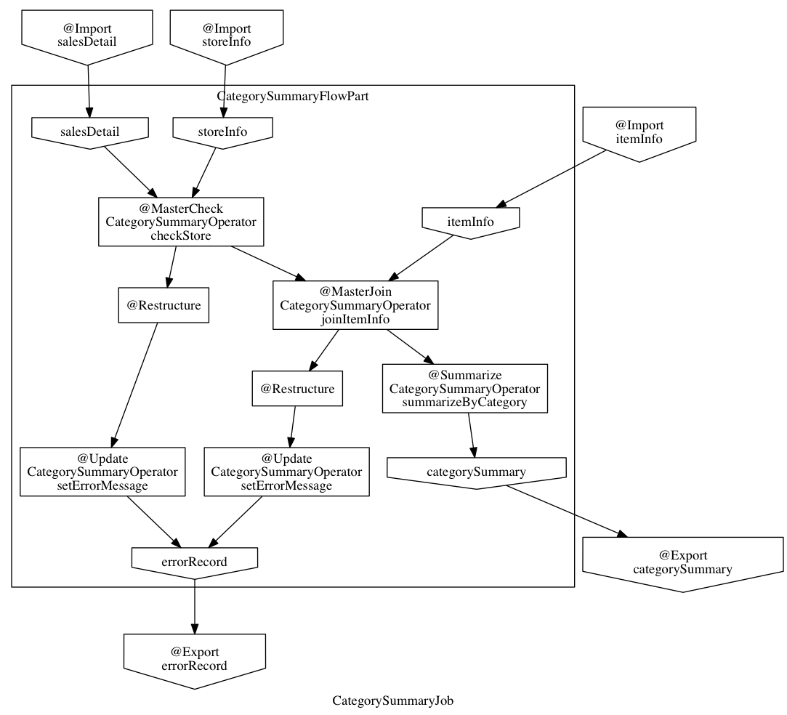
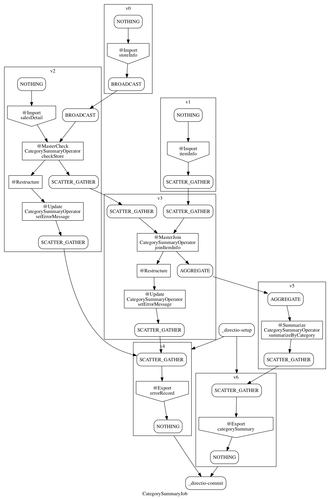

==========================
Asakusa CLI ユーザーガイド
==========================

この文書では、Asakusa CLI ( :program:`asakusa` コマンド ) の利用方法について説明します。

..  attention::
    Asakusa CLI は Asakusa on MapReduce で生成したバッチアプリケーションには対応していません。

セットアップ
============

Asakusa CLIは開発環境と運用環境の両方で利用することができます。

開発環境のセットアップ
----------------------

開発環境では、開発環境用のAsakusa Frameworkがインストールされた状態であればAsakusa CLIを利用することができます。
開発環境上でAsakusa Frameworkをインストールする手順については、 :doc:`../introduction/start-guide` や :doc:`../application/gradle-plugin` などを参照してください。

運用環境のセットアップ
----------------------

運用環境では、バッチアプリケーションをビルドして生成するデプロイメントアーカイブが運用環境に配置された状態であればAsakusa CLIを利用することができます。
運用環境上でデプロイメントアーカイブを配置する手順については、 :doc:`../administration/deployment-guide` などを参照してください。

:program:`asakusa` コマンド
---------------------------

Asakusa CLIの各機能は :program:`asakusa` コマンドを通して利用します。
セットアップが完了した環境であれば、 :program:`asakusa` コマンドは ``$ASAKUSA_HOME/bin`` 配下に配置されています。
コマンドラインから :program:`asakusa` コマンドを利用する場合、 ``$ASAKUSA_HOME/bin`` 配下に環境変数 ``PATH`` を通しておくと便利です。

以降本書で :program:`asakusa` コマンドを実行する例を示す際には、上記の ``PATH`` 環境変数が設定済であるものとします。

正しくセットアップが行われている環境でコマンドラインから :program:`asakusa` コマンドを実行すると、以下のように表示されます。

..  code-block:: sh

    $ asakusa
    Usage: asakusa <command> <command options>

    The available commands are:
        generate - Generates resources from DSL information.
        list - Displays DSL information as list style.
        run - Runs a batch application.
        version - Displays Asakusa Framework version.

    See 'asakusa <command> --help' for more information on a specific command.

エラーが返される等で上記のように表示されない場合は、セットアップ環境を確認してください。

コマンド体系
============

サブコマンド
------------

:program:`asakusa` コマンドはサブコマンドを指定することで様々な機能を呼び出します。
サブコマンドには :program:`list` や :program:`run` 、 :program:`generate` といったものがあります。
サブコマンドの中には、さらにサブコマンドを要求するものもあります。

コマンドラインから実行する際には、サブコマンド間をスペースで区切って指定します。

例えば、:program:`asakusa list batch` のように実行すると、環境上に配置されたバッチアプリケーション一覧をリストとして表示します。

..  code-block:: sh

    $ asakusa list batch
    m3bp.example.summarizeSales
    spark.example.summarizeSales

パラメータ
----------

多くのサブコマンドでは、サブコマンドに続けてバッチIDなどの処理の対象を指定するパラメータを指定します。

コマンドラインから実行する際には、サブコマンドの後にパラメータをスペースで区切って指定します。

例えば、:program:`asakusa list operator` は指定したバッチIDに対応するアプリケーションに含まれる演算子の一覧をリストとして表示します。

..  code-block:: sh

    $ asakusa list operator m3bp.example.summarizeSales
    CategorySummaryOperator#checkStore(@MasterCheck)
    CategorySummaryOperator#joinItemInfo(@MasterJoin)
    CategorySummaryOperator#setErrorMessage(@Update)
    CategorySummaryOperator#setErrorMessage(@Update)
    CategorySummaryOperator#summarizeByCategory(@Summarize)

オプション
----------

各サブコマンドにはサブコマンド共通、または固有のオプションが存在します。

コマンドラインから実行する際には、サブコマンドの後、またはパラメータ後にスペースで区切って指定します。
多くのLinuxコマンドと同様に、いくつかのオプションでは ``--`` から始まる記法の他、 ``-`` から始まる短縮記法を利用できます。

オプションによっては、オプション固有のパラメータを指定するものもあります。
通常、オプションとそのパラメータはスペースで区切って指定しますが、
一部のオプションでは ``-Akey=value`` のようにスペースで区切らずに指定することも可能です。

以下はサブコマンド共通の主なオプションです。

..  program:: asakusa subcommand common

..  option:: -v, --verbose

    コマンド実行結果の出力に詳細な情報を含める。

..  option:: -h, --help

    ヘルプメッセージを表示する。
    サブコマンドが要求するオプションや追加のサブコマンドを確認する。

    ..  code-block:: sh

        $ asakusa run --help
        Usage: asakusa run [options] batch-ID
          Options:
            -A, --batch-argument
              Defines a batch argument.
              Syntax: -Akey=value
              Default: {}
            -B, --batchapps
              Batch application base directory (ASAKUSA_BATCHAPPS_HOME).
            ...

コマンドリファレンス
====================

:program:`asakusa` コマンドのサブコマンド一覧を以下に示します。

..  list-table:: :program:`asakusa` サブコマンド
    :widths: 2 8
    :header-rows: 1

    * - サブコマンド
      - 説明
    * - :ref:`asakusa-cmd-run`
      - バッチアプリケーションを実行する
    * - :ref:`asakusa-cmd-list`
      - バッチアプリケーションのDSL情報をリスト形式で表示する
    * - :ref:`asakusa-cmd-generate`
      - バッチアプリケーションのDSL情報から様々なリソースを生成する
    * - :ref:`asakusa-cmd-version`
      - Asakusa Frameworkのバージョン情報を表示する。

.. _`asakusa-cmd-run`:

:program:`run`
--------------

:program:`run` は、環境にデプロイされているバッチアプリケーションを実行します。

書式
~~~~

..  code-block:: sh

    asakusa run [options] batch-ID

説明
~~~~

指定したバッチIDに対応するバッチアプリケーションを実行します。
バッチ引数を指定する場合はコマンドラインの末尾にオプション ``-A <変数名>=<値>`` のように記述します。

..  code-block:: sh

    $ asakusa run m3bp.example.summarizeSales -A date=2011-04-01

アプリケーションが正常終了した場合は ``0`` , それ以外の場合は ``0`` でない終了コードを返します。

オプション
~~~~~~~~~~

:program:`run` サブコマンドで使用できる主なオプションを以下に示します。
利用可能なすべてのオプションは、コマンドのヘルプを参照してください。

..  program:: asakusa run

..  option:: -A, --batch-argument key=value...

    実行するバッチアプリケーションのバッチ引数を指定する。

    オプションのパラメータは ``key=value`` 形式で指定する。
    また、以下のように複数のバッチ引数を指定可能。

    ..  code-block:: sh

        $ asakusa run m3bp.example.app -A key1=value1 -A key2=value2

..  option:: -O, --output-style

    :program:`run` コマンド内で実行する外部コマンドの出力形式を以下のパラメータで指定します。

    * ``STANDARD`` : 標準出力および標準エラー出力に対して出力する（デフォルト）
    * ``LOGGING`` : :program:`run` コマンドのロガー [#]_ に対して出力する
    * ``NOTHING`` : 出力を行わない

..  [#] このログは ``com.asakusafw.cli.workflow.executor`` というログ名に対して出力します。また標準の設定ではこのログ名に対してログレベル ``info`` が設定されています。
       ログの設定方法については後述の `ログの設定`_ を参照してください。

Java VMの設定
~~~~~~~~~~~~~

:program:`run` でバッチアプリケーションを実行する際には、Java VMをひとつ起動してそのプロセス内で各実行エンジンや外部連携モジュールの起動コマンドを実行します。

このとき、 :program:`run` を実行するJava VMのオプション引数を、環境変数 ``ASAKUSA_CLIENT_OPTS`` で指定できます。

以下は環境変数の設定例です。

..  code-block:: sh

    export ASAKUSA_CLIENT_OPTS='-Xmx128m'

上記のように書いた場合、Javaのヒープ領域の最大値を ``128MB`` に設定できます。

..  attention::
    ``ASAKUSA_CLIENT_OPTS`` が設定の対象とするのは :program:`run` コマンド用のJava VMの設定で、実行エンジンが使用するJava VMの設定とは異なります。
    例えば :doc:`../m3bp/index` の実行エンジンが使用するJava VMの設定は ``ASAKUSA_M3BP_OPTS`` で指定します。

ログの設定
~~~~~~~~~~

:program:`run` コマンドの標準の設定では、標準のログレベルは ``warn`` 以上のログを出力するよう設定されています。
このため、警告なしにバッチアプリケーションが正常終了する場合、 :program:`run` コマンドのログは出力されません。

ログレベルを変更するなど、 :program:`run` コマンドのログ設定を変更するには、
SLF4JのSimpleLogger [#]_ のシステムプロパティを環境変数 ``ASAKUSA_CLIENT_OPTS`` に設定します。

以下は、 ``info`` 以上のログを出力するようログレベルを設定してバッチアプリケーションを実行する例です。

..  code-block:: sh

    export ASAKUSA_CLIENT_OPTS=-Dorg.slf4j.simpleLogger.defaultLogLevel=info
    asakusa run m3bp.example.app ...

..  attention::
    ここでの説明で対象とするのは :program:`run` コマンド用のログの設定で、実行エンジンが使用するログの設定とは異なります。
    例えば :doc:`../m3bp/index` の実行エンジンが使用するログの設定は ``$ASAKUSA_HOME/m3bp/conf/logback.xml`` で指定します。

また、標準の設定では :program:`run` コマンドで実行する外部コマンドの出力は、標準出力および標準エラー出力に対して出力するようになっています。
この出力を :program:`run` コマンドのロガー経由で出力させるようにするには ``-O LOGGING`` オプションを指定します。

..  code-block:: sh

    asakusa run -O LOGGING m3bp.example.app ...

.. [#] https://www.slf4j.org/api/org/slf4j/impl/SimpleLogger.html

.. _`asakusa-cmd-list`:

:program:`list`
---------------

:program:`list` は、バッチアプリケーションのDSL情報から様々な観点のリストを表示します。
:program:`list` のサブコマンド一覧を以下に示します。

..  list-table:: :program:`list` サブコマンド
    :widths: 2 8
    :header-rows: 1

    * - サブコマンド
      - 説明
    * - :ref:`asakusa-cmd-list-batch`
      - バッチアプリケーションの一覧を表示する
    * - :ref:`asakusa-cmd-list-parameter`
      - バッチ引数の一覧を表示する
    * - :ref:`asakusa-cmd-list-jobflow`
      - ジョブフローの一覧を表示する
    * - :ref:`asakusa-cmd-list-operator`
      - 演算子の一覧を表示する
    * - :ref:`asakusa-cmd-list-directio`
      - :doc:`Direct I/O <../directio/index>` の入出力情報の一覧を表示する
    * - :ref:`asakusa-cmd-list-hive`
      - :doc:`../directio/using-hive` の入出力情報の一覧を表示する
    * - :ref:`asakusa-cmd-list-windgate`
      - :doc:`WindGate <../windgate/index>` の入出力情報の一覧を表示する
    * - :ref:`asakusa-cmd-list-plan`
      - 実行計画の情報を表示する

オプション
~~~~~~~~~~

:program:`list` のサブコマンド共通で使用できる主なオプションを以下に示します。

..  option:: -e, --encoding encoding

    出力結果の文字セットエンコーディングを指定する。

    デフォルトでは環境の標準エンコーディングを使用する。

..  option:: -o, --output file

    表示結果を指定したファイルパスに保存する。
    デフォルトでは標準出力に表示結果を出力する。

..  option:: -v, --verbose

    コマンド実行結果の出力に詳細な情報を含める。

    ..  hint::
        :program:`list` のサブコマンドはこのオプションの有無で出力形式が大きく異なり、サブコマンドに対応した様々な詳細情報を表示することができます。

..  option:: --flow, --jobflow flow-id

    指定したフローIDに対応するジョブフローに含まれる情報のみを出力する( :program:`batch` , :program:`parameter` サブコマンドは指定不可)。

.. _`asakusa-cmd-list-batch`:

:program:`batch`
~~~~~~~~~~~~~~~~

:program:`batch` は環境にデプロイされているバッチアプリケーションの一覧を表示します。

書式
~~~~

..  code-block:: sh

    asakusa list batch [options]

使用例
~~~~~~

:program:`batch` を標準のオプションで実行すると、環境にデプロイされているバッチアプリケーションのバッチID一覧を表示します。

..  code-block:: sh

    $ asakusa list batch
    m3bp.example.summarizeSales
    spark.example.summarizeSales

:program:`batch` を詳細オプション付きで実行すると、バッチクラスや ``@Batch`` 注釈に定義したコメントも表示します。

..  code-block:: sh

    $ asakusa list batch -v
    m3bp.example.summarizeSales:
          class: com.example.batch.SummarizeBatch
        comment: Asakusa Framework example batch application
    spark.example.summarizeSales:
          class: com.example.batch.SummarizeBatch
        comment: Asakusa Framework example batch application

.. _`asakusa-cmd-list-parameter`:

:program:`parameter`
~~~~~~~~~~~~~~~~~~~~

:program:`parameter` は指定されたバッチIDに対応する、バッチアプリケーションのバッチ引数一覧を表示します。

書式
~~~~

..  code-block:: sh

    asakusa list parameter [options] batch-id

使用例
~~~~~~

:program:`parameter` を標準のオプションで実行すると、バッチ引数名 ( ``key`` )の一覧を表示します。

..  code-block:: sh

    $ asakusa list parameter m3bp.example.summarizeSales
    date

:program:`parameter` を詳細オプション付きで実行すると、``@Parameter`` 注釈に定義した属性情報も表示します。

..  code-block:: sh

    $ asakusa list parameter -v m3bp.example.summarizeSales
    date:
          comment: The target date
          pattern: \d{4}-\d{2}-\d{2}
        mandatory: true

.. _`asakusa-cmd-list-jobflow`:

:program:`jobflow`
~~~~~~~~~~~~~~~~~~

:program:`jobflow` は指定されたバッチIDに対応する、バッチアプリケーションに含まれるジョブフローの一覧を表示します。

書式
~~~~

..  code-block:: sh

    asakusa list jobflow [options] batch-id

使用例
~~~~~~

:program:`jobflow` を標準のオプションで実行すると、バッチアプリケーションに含まれるジョブフローのフローID一覧を表示します。

..  code-block:: sh

    $ asakusa list jobflow spark.PosDataSummarizationBatch
    CleaningJobFlow
    SummarizeJobFlow

:program:`jobflow` を詳細オプション付きで実行すると、ジョブフロー間の依存関係やジョブフローの各フェーズ情報も表示します。

..  code-block:: sh

    $ asakusa list jobflow -v spark.PosDataSummarizationBatch
    CleaningJobFlow (com.asakusafw.tutorial.posdata_summarization.jobflow.CleaningJobFlow):
        blockers: -
        import:
            windgate (@posdata-summarization)
        main:
            spark (@spark)
        export:
            windgate (@posdata-summarization)
        finalize:
            windgate (@posdata-summarization)
    SummarizeJobFlow (com.asakusafw.tutorial.posdata_summarization.jobflow.SummarizeJobFlow):
        blockers:
            CleaningJobFlow
        import:
            windgate (@posdata-summarization)
        main:
            spark (@spark)
        export:
            windgate (@posdata-summarization)
        finalize:
            windgate (@posdata-summarization)

.. _`asakusa-cmd-list-operator`:

:program:`operator`
~~~~~~~~~~~~~~~~~~~

:program:`operator` は指定したバッチIDに対応する、バッチアプリケーションに含まれる演算子の一覧を表示します。

書式
~~~~

..  code-block:: sh

    asakusa list operator [options] batch-id

使用例
~~~~~~

:program:`operator` を標準のオプションで実行すると、バッチアプリケーションに含まれる演算子の一覧を表示します。
フロー部品を使用している場合、フロー部品に含まれる演算子が表示されます。

..  code-block:: sh

    $ asakusa list operator m3bp.example.summarizeSales
    CategorySummaryOperator#checkStore(@MasterCheck)
    CategorySummaryOperator#joinItemInfo(@MasterJoin)
    CategorySummaryOperator#setErrorMessage(@Update)
    CategorySummaryOperator#summarizeByCategory(@Summarize)

:program:`operator` を詳細オプション付きで実行すると、演算子クラスの完全修飾名や演算子に指定した値引数の情報も表示します。

..  code-block:: sh

    $ asakusa list operator -v m3bp.example.summarizeSales
    com.example.operator.CategorySummaryOperator#checkStore(@MasterCheck){}
    com.example.operator.CategorySummaryOperator#joinItemInfo(@MasterJoin){}
    com.example.operator.CategorySummaryOperator#setErrorMessage(@Update){message:String=商品不明}
    com.example.operator.CategorySummaryOperator#setErrorMessage(@Update){message:String=店舗不明}
    com.example.operator.CategorySummaryOperator#summarizeByCategory(@Summarize){}

.. _`asakusa-cmd-list-directio`:

:program:`directio`
~~~~~~~~~~~~~~~~~~~

:program:`directio` は指定したバッチIDに対応する、バッチアプリケーションに含まれるDirect I/Oの入出力一覧を表示します。
:program:`directio` のサブコマンド一覧を以下に示します。

..  list-table:: :program:`directio` サブコマンド
    :widths: 2 8
    :header-rows: 1

    * - サブコマンド
      - 説明
    * - :program:`input`
      - ファイル入力の定義情報を表示する。
    * - :program:`output`
      - ファイル出力の定義情報を表示する。

書式
~~~~

..  code-block:: sh

    asakusa list directio {input|output} [options] batch-id

使用例
~~~~~~

:program:`directio` を標準のオプションで実行すると、バッチアプリケーションに含まれるDirect I/Oのベースパスと入出力パターンをそれぞれ表示します。

..  code-block:: sh

    $ asakusa list directio input m3bp.example.summarizeSales
    master::item_info.csv
    master::store_info.csv
    sales::**/${date}.csv

    $ asakusa list directio output m3bp.example.summarizeSales
    result/category::result.csv
    result/error::${date}.csv

:program:`directio` を詳細オプション付きで実行すると、Direct I/Oの入出力定義で記述した情報を詳細に表示します。

..  code-block:: sh

    $ asakusa list directio input -v m3bp.example.summarizeSales
    com.example.jobflow.ItemInfoFromCsv:
               base-path: master
        resource-pattern: item_info.csv
               data-type: com.example.modelgen.dmdl.model.ItemInfo
            filter-class: N/A
            format-class: com.example.modelgen.dmdl.csv.ItemInfoCsvFormat
                optional: false
    com.example.jobflow.StoreInfoFromCsv:
               base-path: master
        resource-pattern: store_info.csv
               data-type: com.example.modelgen.dmdl.model.StoreInfo
            filter-class: N/A
            format-class: com.example.modelgen.dmdl.csv.StoreInfoCsvFormat
                optional: false
    com.example.jobflow.SalesDetailFromCsv:
               base-path: sales
        resource-pattern: **/${date}.csv
               data-type: com.example.modelgen.dmdl.model.SalesDetail
            filter-class: N/A
            format-class: com.example.modelgen.dmdl.csv.SalesDetailCsvFormat
                optional: false

    $ asakusa list directio output -v m3bp.example.summarizeSales
    com.example.jobflow.CategorySummaryToCsv:
               base-path: result/category
        resource-pattern: result.csv
                   order: [-selling_price_total]
         delete-patterns: [*]
               data-type: com.example.modelgen.dmdl.model.CategorySummary
            format-class: com.example.modelgen.dmdl.csv.CategorySummaryCsvFormat
    com.example.jobflow.ErrorRecordToCsv:
               base-path: result/error
        resource-pattern: ${date}.csv
                   order: [+file_name]
         delete-patterns: [*]
               data-type: com.example.modelgen.dmdl.model.ErrorRecord
            format-class: com.example.modelgen.dmdl.csv.ErrorRecordCsvFormat

.. _`asakusa-cmd-list-hive`:

:program:`hive`
~~~~~~~~~~~~~~~

:program:`hive` は指定したバッチIDに対応する、バッチアプリケーションに含まれるDirect I/O Hiveの入出力一覧を表示します。
:program:`hive` のサブコマンド一覧を以下に示します。

..  list-table:: :program:`hive` サブコマンド
    :widths: 2 8
    :header-rows: 1

    * - サブコマンド
      - 説明
    * - :program:`input`
      - Hiveテーブル入力の定義情報を表示する。
    * - :program:`output`
      - Hiveテーブル出力の定義情報を表示する。

書式
~~~~

..  code-block:: sh

    asakusa list hive {input|output} [options] batch-id

使用例
~~~~~~

:program:`hive` を標準のオプションで実行すると、バッチアプリケーションに含まれるDirect I/O Hiveの入出力テーブル名をそれぞれ表示します。

..  code-block:: sh

    $ asakusa list hive input m3bp.example.summarizeSales
    item_info
    sales_detail
    store_info

    $ asakusa list hive output m3bp.example.summarizeSales
    category_summary
    error_record

:program:`hive` を詳細オプション付きで実行すると、Direct I/O Hiveの入出力定義で記述した情報を詳細に表示します。

..  code-block:: sh

    $ asakusa list hive input m3bp.example.summarizeSales -v
    item_info:
               port-name: itemInfo
             description: com.example.jobflow.ItemInfoFromParquet
               base-path: tables/item_info
        resource-pattern: **/*
                 columns: [item_code:STRING, item_name:STRING, department_code:STRING, department_name:STRING, category_code:STRING, category_name:STRING, unit_selling_price:INT, registered_date:STRING, begin_date:STRING, end_date:STRING]
              row-format: N/A
          storage-format: PARQUET
              properties: {}
                 comment: 商品マスタ
    sales_detail:
               port-name: salesDetail
             description: com.example.jobflow.SalesDetailFromOrc
               base-path: tables/sales_detail
        resource-pattern: **/*
                 columns: [sales_date_time:TIMESTAMP, store_code:STRING, item_code:STRING, amount:INT, unit_selling_price:INT, selling_price:INT]
              row-format: N/A
          storage-format: ORC
              properties: {orc.stripe.size=67108864, orc.compress=SNAPPY}
                 comment: 売上明細
    store_info:
               port-name: storeInfo
             description: com.example.jobflow.StoreInfoFromParquet
               base-path: tables/store_info
        resource-pattern: **/*
                 columns: [store_code:STRING, store_name:STRING]
              row-format: N/A
          storage-format: PARQUET
              properties: {}
                 comment: 店舗マスタ

    $ asakusa list hive output m3bp.example.summarizeSales -v
    category_summary:
               port-name: categorySummary
             description: com.example.jobflow.CategorySummaryToOrc
               base-path: tables/category_summary
        resource-pattern: *
                 columns: [category_code:STRING, amount_total:BIGINT, selling_price_total:BIGINT]
              row-format: N/A
          storage-format: ORC
              properties: {orc.stripe.size=67108864, orc.compress=SNAPPY}
                 comment: カテゴリ別売上集計
    error_record:
               port-name: errorRecord
             description: com.example.jobflow.ErrorRecordToParquet
               base-path: tables/error_record
        resource-pattern: *
                 columns: [sales_date_time:TIMESTAMP, store_code:STRING, item_code:STRING, message:STRING]
              row-format: N/A
          storage-format: PARQUET
              properties: {}
                 comment: エラー情報

.. _`asakusa-cmd-list-windgate`:

:program:`windgate`
~~~~~~~~~~~~~~~~~~~

:program:`windgate` は指定したバッチIDに対応する、バッチアプリケーションに含まれるWindGateの入出力一覧を表示します。
:program:`windgate` のサブコマンド一覧を以下に示します。

..  list-table:: :program:`windgate` サブコマンド
    :widths: 2 8
    :header-rows: 1

    * - サブコマンド
      - 説明
    * - :program:`input`
      - WindGate入力の定義情報を表示する。
    * - :program:`output`
      - WindGate出力の定義情報を表示する。

書式
~~~~

..  code-block:: sh

    asakusa list windgate {input|output} [options] batch-id

使用例
~~~~~~

:program:`windgate` を標準のオプションで実行すると、バッチアプリケーションに含まれるWindGateの入出力情報の定義
（プロファイル名、リソース名、テーブル名またはファイル名）をそれぞれ表示します。

..  code-block:: sh

    $ asakusa list windgate input m3bp.example.summarizeSales
    asakusa::jdbc::ITEM_INFO
    asakusa::jdbc::SALES_DETAIL
    asakusa::jdbc::STORE_INFO

    $ asakusa list windgate output m3bp.example.summarizeSales
    asakusa::jdbc::CATEGORY_SUMMARY
    asakusa::jdbc::ERROR_RECORD

:program:`windgate` を詳細オプション付きで実行すると、WindGateの入出力定義で記述した情報を詳細に表示します。

..  code-block:: sh

    $ asakusa list windgate input -v m3bp.example.summarizeSales
    com.asakusafw.example.jdbc.jobflow.ItemInfoFromJdbc:
         profile-name: asakusa
        resource-name: jdbc
              columns: ITEM_CODE, ITEM_NAME, DEPARTMENT_CODE, DEPARTMENT_NAME, CATEGORY_CODE, CATEGORY_NAME, UNIT_SELLING_PRICE, REGISTERED_DATE, BEGIN_DATE, END_DATE
          jdbcSupport: com.asakusafw.example.jdbc.modelgen.dmdl.jdbc.ItemInfoJdbcSupport
                table: ITEM_INFO
    com.asakusafw.example.jdbc.jobflow.SalesDetailFromJdbc:
         profile-name: asakusa
        resource-name: jdbc
              columns: SALES_DATE_TIME, STORE_CODE, ITEM_CODE, AMOUNT, UNIT_SELLING_PRICE, SELLING_PRICE
          jdbcSupport: com.asakusafw.example.jdbc.modelgen.dmdl.jdbc.SalesDetailJdbcSupport
                table: SALES_DETAIL
    com.asakusafw.example.jdbc.jobflow.StoreInfoFromJdbc:
         profile-name: asakusa
        resource-name: jdbc
              columns: STORE_CODE, STORE_NAME
          jdbcSupport: com.asakusafw.example.jdbc.modelgen.dmdl.jdbc.StoreInfoJdbcSupport
                table: STORE_INFO

    $ asakusa list windgate output -v m3bp.example.summarizeSales
    com.asakusafw.example.jdbc.jobflow.CategorySummaryToJdbc:
         profile-name: asakusa
        resource-name: jdbc
              columns: CATEGORY_CODE, AMOUNT, SELLING_PRICE
          jdbcSupport: com.asakusafw.example.jdbc.modelgen.dmdl.jdbc.CategorySummaryJdbcSupport
            operation: insert_after_truncate
                table: CATEGORY_SUMMARY
    com.asakusafw.example.jdbc.jobflow.ErrorRecordToJdbc:
         profile-name: asakusa
        resource-name: jdbc
              columns: SALES_DATE_TIME, STORE_CODE, ITEM_CODE, MESSAGE
          jdbcSupport: com.asakusafw.example.jdbc.modelgen.dmdl.jdbc.ErrorRecordJdbcSupport
            operation: insert_after_truncate
                table: ERROR_RECORD

.. _`asakusa-cmd-list-plan`:

:program:`plan`
~~~~~~~~~~~~~~~

:program:`plan` は指定したバッチIDに対応する、バッチアプリケーションの実行計画に含まれるvertexの一覧を表示します。

書式
~~~~

..  code-block:: sh

    asakusa list plan [options] batch-id

使用例
~~~~~~

:program:`plan` を標準のオプションで実行すると、バッチアプリケーションに含まれるvertex IDの一覧を表示します。

..  code-block:: sh

    $ asakusa list plan m3bp.example.summarizeSales
    _directio-commit
    _directio-setup
    v0
    v1
    v2
    v3
    v4
    v5
    v6

:program:`plan` を詳細オプション付きで実行すると、vertex間の依存関係やvertexに含まれる演算子の情報も表示します。

..  code-block:: sh

    $ asakusa list plan -v m3bp.example.summarizeSales
    _directio-commit:
        label: N/A
        blockers: {v4, v6}
        operators: -
    _directio-setup:
        label: N/A
        blockers: {}
        operators: -
    v0:
        label: ExternalInput(storeInfo)
        blockers: {}
        operators: -
    v1:
        label: ExternalInput(itemInfo)
        blockers: {}
        operators: -
    v2:
        label: ExternalInput(salesDetail)
        blockers: {v0}
        operators:
            com.example.operator.CategorySummaryOperator#checkStore(@MasterCheck)
            com.example.operator.CategorySummaryOperator#setErrorMessage(@Update)
    v3:
        label: @MasterJoin:CategorySummaryOperator.joinItemInfo
        blockers: {v1, v2}
        operators:
            com.example.operator.CategorySummaryOperator#setErrorMessage(@Update)
            com.example.operator.CategorySummaryOperator#joinItemInfo(@MasterJoin)
    v4:
        label: ExternalOutput(errorRecord)
        blockers: {_directio-setup, v2, v3}
        operators: -
    v5:
        label: @Summarize:CategorySummaryOperator.summarizeByCategory
        blockers: {v3}
        operators:
            com.example.operator.CategorySummaryOperator#summarizeByCategory(@Summarize)
    v6:
        label: ExternalOutput(categorySummary)
        blockers: {_directio-setup, v5}
        operators: -

また、オプション ``--vertex`` にvertex IDを指定して実行すると、指定したvertexの情報のみを表示します。

..  code-block:: sh

    $ asakusa list plan m3bp.example.summarizeSales --vertex v3
    label: @MasterJoin:CategorySummaryOperator.joinItemInfo
    blockers: {v1, v2}
    operators:
        com.example.operator.CategorySummaryOperator#setErrorMessage(@Update)
        com.example.operator.CategorySummaryOperator#joinItemInfo(@MasterJoin)

..  hint::
    vertex IDはバッチアプリケーション実行時のログやスタックトレースなどに含まれます。
    これらの情報と :program:`plan` コマンドの出力内容、
    または後述の :program:`asakusa generate dot plan` コマンドによって生成する実行計画グラフの内容を付き合わせることで、
    ログやスタックトレースに対応する演算子の処理や、その前後に実行される演算子の処理をある程度絞り込むことができます。

.. _`asakusa-cmd-generate`:

:program:`generate`
-------------------

:program:`generate` は、バッチアプリケーションのDSL情報から様々なリソースを生成します。
:program:`generate` のサブコマンド一覧を以下に示します。

..  list-table:: :program:`generate` サブコマンド
    :widths: 2 8
    :header-rows: 1

    * - サブコマンド
      - 説明
    * - :ref:`asakusa-cmd-generate-dot`
      - グラフ表示ツール Graphviz [#]_ 向けの ``dot`` スクリプトを生成する
    * - :ref:`asakusa-cmd-generate-ddl`
      - DDLスクリプトを生成する

..  [#] http://www.graphviz.org/

..  _`asakusa-cmd-generate-dot`:

:program:`dot`
~~~~~~~~~~~~~~

:program:`dot` はバッチアプリケーションのDSL情報からグラフ表示ツール Graphviz 向けの ``dot`` スクリプトを生成します。
:program:`dot` のサブコマンド一覧を以下に示します。

..  list-table:: :program:`dot` サブコマンド
    :widths: 2 8
    :header-rows: 1

    * - サブコマンド
      - 説明
    * - :program:`jobflow`
      - ジョブフローグラフを ``dot`` スクリプトとして生成する
    * - :program:`operator`
      - 演算子グラフを ``dot`` スクリプトとして生成する
    * - :program:`plan`
      - Batch DSLコンパイルによって生成される実行計画グラフを ``dot`` スクリプトとして生成する

書式
^^^^

..  code-block:: sh

    asakusa generate dot {jobflow|operator|plan} [options] batch-id

説明
^^^^

指定したバッチIDに対応するバッチアプリケーションのDSL情報に基づいて、 ``dot`` スクリプトを生成します。

生成した ``dot`` スクリプトは Graphviz の :program:`dot` コマンドなどを使用してPDFや画像ファイルに変換したり、デスクトップ環境のクライアントツールから表示することができます。

オプション
^^^^^^^^^^

:program:`dot` サブコマンドで使用できる主なオプションを以下に示します。
利用可能なすべてのオプションは、コマンドのヘルプを参照してください。

..  program:: asakusa generate dot

..  option:: -e, --encoding encoding

    生成するスクリプトの文字セットエンコーディングを指定する。

    デフォルトでは環境の標準エンコーディングを使用する。

    ..  hint::
        Graphvizで日本語を扱う場合、UTF-8を指定してスクリプトを生成する必要があります。
        Windows環境など、標準エンコーディングがUTF-8以外の環境でスクリプトを生成する場合、
        このオプションをスクリプトの出力先を指定する ``-o`` オプションと合わせて指定します。

..  option:: -o, --output file

    生成したスクリプトを指定したファイルパスに保存する。
    デフォルトでは標準出力にスクリプトを出力する。

..  option:: --flow-part, --flowpart flowpart-classname

    ( :program:`operator` サブコマンドのみ )指定したフロー部品クラス名に対応するフロー部品の演算子グラフを生成する。

..  option:: --flow, --jobflow flow-id

    ( :program:`operator` サブコマンドのみ )指定したフローIDに対応するジョブフローの演算子グラフを生成する。

使用例
^^^^^^

以下はバッチアプリケーションの演算子グラフを生成し、 :program:`dot` コマンドでPDFに変換する例です。

..  code-block:: sh

    $ asakusa generate dot operator m3bp.example.summarizeSales -o build/operator-graph.dot
    $ dot -Tpdf -o build/operator-graph.pdf build/operator-graph.dot

以下はバッチアプリケーションの実行計画グラフを演算子情報を付加して生成し、:program:`dot` コマンドで画像ファイルに変換する例です。

..  code-block:: sh

    $ asakusa generate dot plan m3bp.example.summarizeSales --show-operator -o build/plan-graph.dot
    $ dot -Tpng -o build/plan-graph.png build/plan-graph.dot

..  hint::
    実行計画グラフの各Vertexの上部にはvertex IDが表示されます ( ``v0`` , ``v1`` といった値が表示されている部分 )。
    vertex IDについては :program:`asakusa list` の :ref:`asakusa-cmd-list-plan` サブコマンドの説明を参考にしてください。

..  _`asakusa-cmd-generate-ddl`:

:program:`ddl`
~~~~~~~~~~~~~~

:program:`ddl` はバッチアプリケーションのDSL情報からDDLスクリプトを生成する
:program:`ddl` のサブコマンド一覧を以下に示します。

..  list-table:: :program:`ddl` サブコマンド
    :widths: 2 8
    :header-rows: 1

    * - サブコマンド
      - 説明
    * - :program:`hive`
      - :doc:`../directio/using-hive` のDSL情報からHive DDLスクリプトを生成する。

書式
^^^^

..  code-block:: sh

    asakusa generate ddl hive [options] batch-id

説明
^^^^

指定したバッチIDに対応するバッチアプリケーションが使用する、拡張属性を持つDMDLスクリプト情報から各種DDLスクリプトを生成します。
現時点では、 :doc:`../directio/using-hive` 向けのHive DDLスクリプトを生成する :program:`hive` サブコマンドのみが使用できます。

:program:`hive` サブコマンドは指定したバッチIDに対応するバッチアプリケーションのDMDLスクリプト情報に基づいてHive用のDDLスクリプトを生成します。

..  see also::
    同様の機能は :doc:`../application/gradle-plugin` - :ref:`gradle-plugin-task-hiveddl` に記載のGradleプラグイン機能としても提供しています。

オプション
^^^^^^^^^^
:program:`ddl hive` サブコマンドで使用できる主なオプションを以下に示します。
利用可能なすべてのオプションは、コマンドのヘルプを参照してください。

..  program:: asakusa generate ddl hive

..  option:: -e, --encoding encoding

    生成するスクリプトの文字セットエンコーディングを指定する。

    デフォルトでは環境の標準エンコーディングを使用する。

    ..  hint::
        Hiveスクリプトのコメントなどに日本語を含める場合、UTF-8を指定してスクリプトを生成する必要があります。
        Windows環境など、標準エンコーディングがUTF-8以外の環境でスクリプトを生成する場合、
        このオプションをスクリプトの出力先を指定する ``-o`` オプションと合わせて指定します。

..  option:: -o, --output file

    生成したスクリプトを指定したファイルパスに保存する。
    デフォルトでは標準出力にスクリプトを出力する。

..  option:: --database database-name

    生成する ``CRATE TABLE`` 文のテーブル名の前にデータベース名を付与する。

..  option:: --external

    ``CREATE EXTERNAL TABLE`` キーワードを使用して、テーブルをExtrnal Tableとして生成する。

..  option:: -L, --location base-path-prefix=fs-path-pretix...

    生成する ``CREATE TABLE`` 文に ``LOCATION`` キーワード (テーブルに対応するデータファイルを配置するファイルシステム上のパス) を追加する。

    オプションのパラメータには ``ベースパス=ファイルシステムパス`` という形式で、ベースパスに対するファイルシステムのマッピング情報を指定する。
    ファイルシステムパスはURI形式で記述した場合、指定したスキーマに対応するファイルシステムが使用される(例 ``hdfs:///user/asakusa/directio`` )。
    スキーマ部分を省略した場合、環境のデフォルトファイルシステムが使用される(例 ``/user/asakusa/directio`` )。

    このオプションは以下のように複数指定が可能。

    ..  code-block:: sh

        asakusa generate ddl hive m3bp.example.batch -L/=/var -L/tmp=/tmp

    また、ベースパスにバッチ引数を使用する場合は以下のように指定する。

    ..  code-block:: sh

        asakusa generate ddl hive m3bp.example.batch -L'${input}'=/path/to/input -L'${output}'=/path/to/output

..  option:: --table pattern

    指定した正規表現にマッチするテーブルに対してのみDDLスクリプトを生成する。

使用例
^^^^^^

以下はHive DDLスクリプトを生成する例です。

..  code-block:: sh

    asakusa generate ddl hive spark.example.summarizeSales --location /=/user/asakusa/directio/hive -o build/hive-ddl.sql

.. _`asakusa-cmd-version`:

:program:`version`
------------------

:program:`version` は、環境にインストールまたはデプロイされているAsakusa Frameworkのバージョンを表示します。

書式
~~~~

..  code-block:: sh

    asakusa version [options]

使用例
~~~~~~

:program:`version` を標準のオプションで実行すると、Asakusa Frameworkのバージョンを表示します。

..  code-block:: sh

    $ asakusa version
    0.10.0

:program:`version` を詳細オプション付きで実行すると、環境で使用される環境変数やJavaに関する情報も表示します。

..  code-block:: sh

    $ asakusa version -v
    0.10.0
    ASAKUSA_HOME=/home/asakusa/asakusa_home
    java.version=1.8.0_121
    java.vendor=Oracle Corporation
